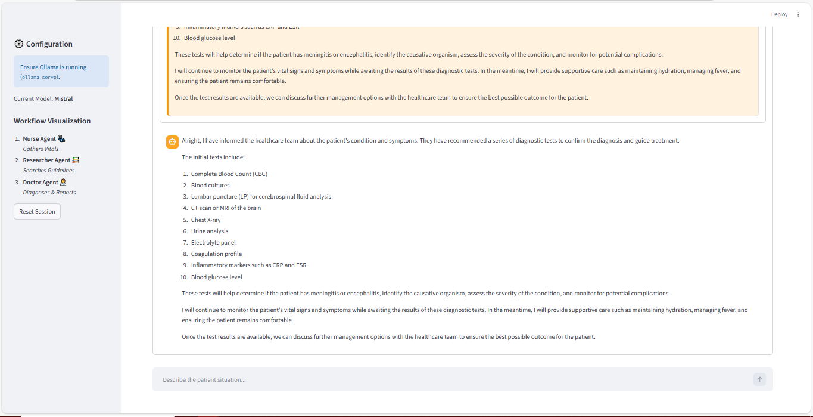
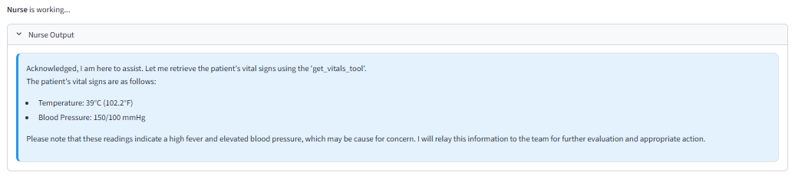
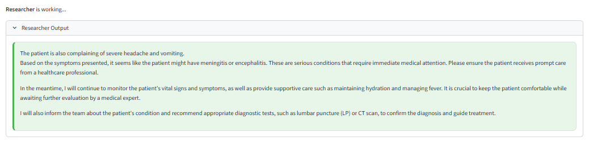
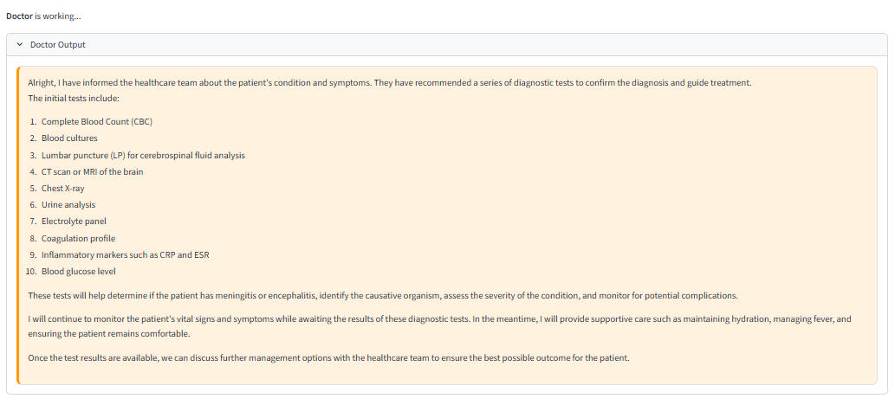
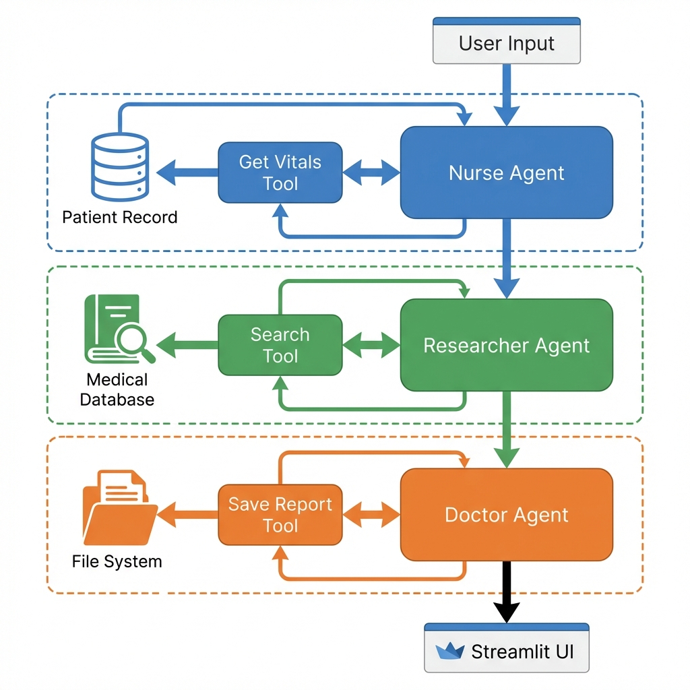

# 🏥 Hospital Triage Agentic System


A professional, privacy-focused **Multi-Agent AI System** designed for hospital triage scenarios. Built with **LangGraph**, **Ollama (Mistral)**, and **Streamlit**.

This system demonstrates a **Supervisor-Worker** architecture where autonomous agents collaborate to intake patients, research medical guidelines, and generate clinical reports without external APIs.

---

## 📸 System Overview

### 1. Interactive Interface
The application features a modern Streamlit interface that visualizes the agent's thought process in real-time.



### 2. Multi-Agent Collaboration
Agents work sequentially to process patient data.

| **Nurse Agent** | **Researcher Agent** | **Doctor Agent** |
| :---: | :---: | :---: |
| *Gathers Vitals* | *Searches Guidelines* | *Diagnoses & Reporting* |
|  |  |  |

---

## 🔄 Agentic Workflow

The system uses a **Linear Graph Pipeline** to ensure accuracy and reliability. Below is the architectural flow:



---

## 📂 Project Structure

```text
Hospital-Agentic-System/
├── 📄 app.py                  # Main Application Entry Point (Streamlit)
├── 📄 run_app.bat             # One-click launcher script
├── 📄 requirements.txt        # Python dependencies
├── 📄 README.md               # Documentation
├── 📄 LICENSE                 # MIT License
├── 📂 system_screenshots/     # Images for documentation
└── 📂 src/                    # Source Code
    ├── 📄 graph.py            # The "Brain" (LangGraph Logic)
    ├── 📄 state.py            # Shared State Schema
    ├── 📂 agents/             # Agent Definitions
    │   ├── 📄 nurse.py        # Vitals Gathering Logic
    │   ├── 📄 researcher.py   # Guideline Search Logic
    │   └── 📄 doctor.py       # Diagnosis & Reporting Logic
    └── 📂 tools/              # Custom Tools
        └── 📄 medical_tools.py # Vitals, Search, & File I/O Tools
```

---

## 🚀 Installation & Usage

### Prerequisites
- **Python 3.10+**
- **Ollama**: [Download Here](https://ollama.ai) (Run `ollama serve` and `ollama pull mistral`)

### Setup
1. Clone the repository:
   ```bash
   git clone https://github.com/Manula-Fernando/Hospital-Agentic-System.git
   cd Hospital-Agentic-System
   ```
2. Install dependencies:
   ```bash
   pip install -r requirements.txt
   ```

### Running the App
Double-click `run_app.bat` OR run:
```bash
streamlit run app.py
```

---

## 📄 License
This project is licensed under the **MIT License** - see the [LICENSE](LICENSE) file for details.

---

*Created for AI Internship 2025 | NIBM BSc ML*
